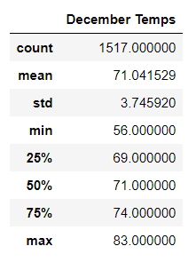

# surfs_up

## Overview
We are helping W.Avy with an analysis to determine the feasability of having a surf shop and ice-cream business in Oahu. To answer the feasability questions, we are specifically looking at the temperature data for the months of June and December in Oahu, in order to determine year-round business sustainability.

## Results

The below are three major highlights of the analysis. Supporting data and visualization are provided below.
* There is not a great difference in temperatures in Oahu between June and December in terms of averages, maximum temp, minimum temp and even the standard deviation
* The max temperature is very similar but there are more number of days with hotter temperature in June when compared to December
* The min temperatures of June vs December show the greatest difference which is 8 degrees Farenheit

### analysis images

## Summary

For W.Avy, in terms of year-round weather, there is a high level of practicaility in opening a surf and ice-cream shop. This is because of the low variance in temperatures between June and Decemeber which are usually the hottest and coldest months of a year. Additionally, the temperatures in decemeber, which is supposed to be the coldest month are anecdoctally what would be considered surfing and ice-cream weather.

### additional queries

Additional queries that would show a deeper look into this analysis would be:
* A look at the last one/two years of weather in June and Decemeber just to understand the recent trends (session.query(Measurement.date, Measurement.tobs).filter(extract('month', Measurement.date)==6).filter(extract('year', Measurement.Date) == 2017)) and one more query with month = 12
* A look at precipitation in the months of June and Decemeber as this would usually mean temporary dip in business due to rain (session.query(Measurement.date, Measurement.precp).filter(extract('month', Measurement.date)==6) one more query with month = 12
